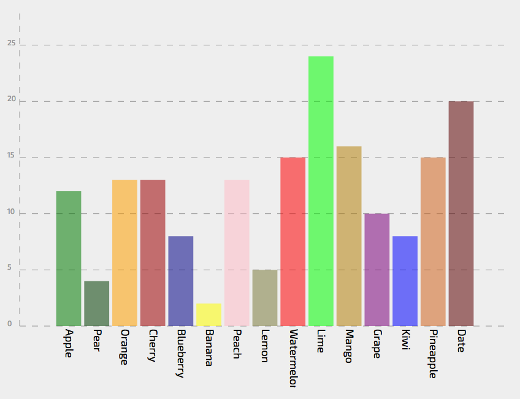
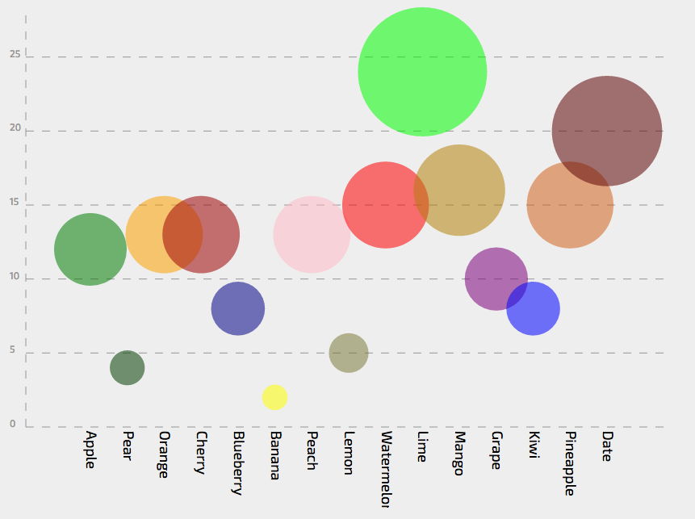
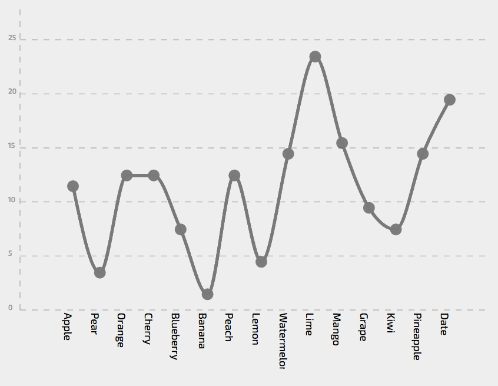
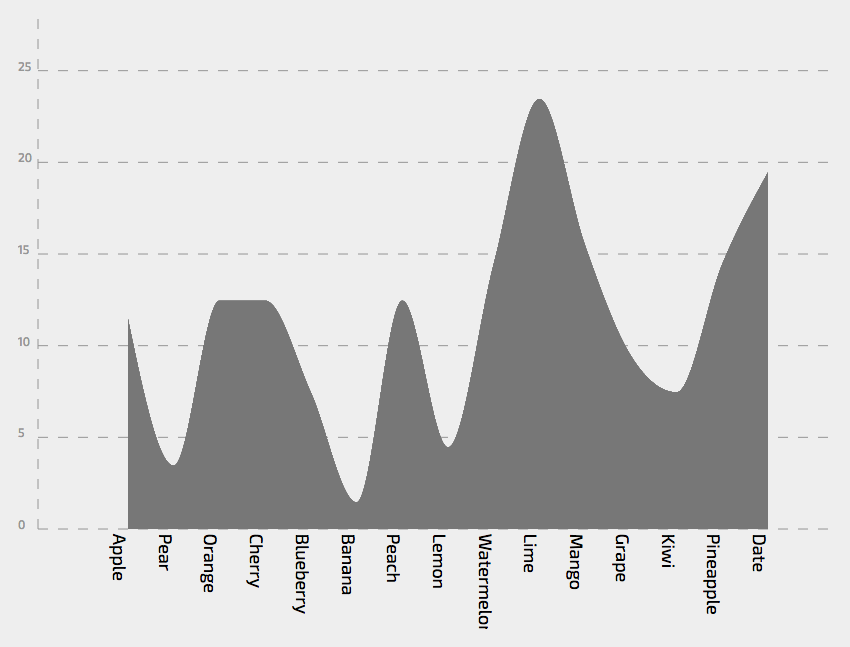

# Assignment 3 - Animated Transitions

Project link: [https://zhangjingjun.github.io/03-Animation/](https://zhangjingjun.github.io/03-Animation/).

# Team

- Jingjun Zhang, zhangjingjun
- Yifei Gao, EFGAO

We designed these animations together. Jingjun implemented the framework and animation of rectangles/circles, which used by bar chart and bubble chart, Yifei implemented the animation of path used by line chart and area chart. 

## First Stage
> The first stage is a bar chart which use the height of bar to represent the count of fruit and different color and name text to represent the type of fruit.




## Seoncd Stage
> The second stage is a bubble chart which the size of bubble represent the count, also the y value of bubble also represent the count number.




## Third Stage
> A line chart which connect the point respectively.




## Fourth Stage
> A area chart which transformed from line chart. The area of this graph does not has meaning but a form of data visualization.



# Technical Achievements

We use SVG to create the rectangle and d3 line generator to
create the line. We use the transition function to achieve the animation between each stage. 
We have assigned a parameter to record the stage position and use switch statement to check which stage should go next. We set a mouse on click listener to achieve the interaction part, when you click the graph it would transfer to the next graph. The last stage would return to the first stage.


# Design Achievements

To reflect the number of given fruits, we designed several different charts, including line chart, bar chart, bubble chart and area chart. All these charts are displayed in a simplified coordinate grid. Along with X axis and Y axis, we provided several horizontal dotted lines marked with numbers to help user to decide the number a point, a circle or a bar represented. However, to make user focus on graphs, we used color close to background to represent these auxiliary elements. We use different color for each bar and circle in bar chart and bubble chart but use a unique color for line chart and area chart, because we tried to help user distinguish separated parts only.
As for transition, we set the delay time and duration time.
We avoid to set the duration time too long incase the user would be inpatient. Also we set a tiny delay time between each element to give a better visualization effect.


